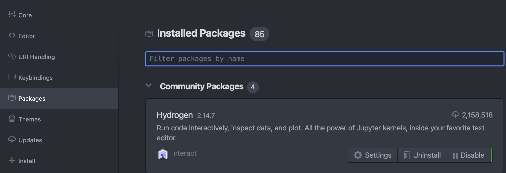
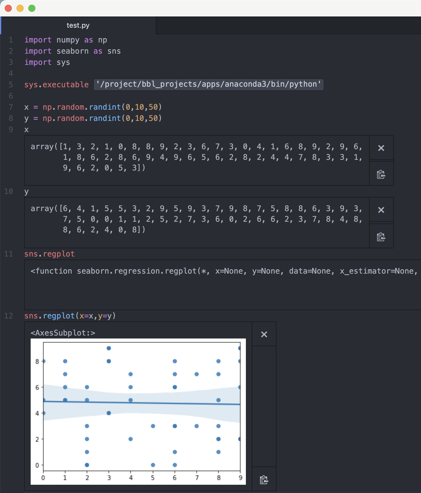

# Interfacing with the clusters
{: .no_toc }

## Table of contents
{: .no_toc .text-delta }

## Connecting to the clusters

This is covered in the cluster specific documentation, but for completeness:

If you are using a Mac, first install [OSXFuse](https://github.com/osxfuse/osxfuse/releases/download/macfuse-4.0.5/macfuse-4.0.5.dmg) and [SSHFS](https://github.com/osxfuse/sshfs/releases/download/osxfuse-sshfs-2.5.0/sshfs-2.5.0.pkg). You should not need it for this, but you should, in general, have [X11](https://www.xquartz.org/).

PMACS

```bash
#my username is mb3152
#login
ssh -Y mb3152@scisub.pmacs.upenn.edu
#mount to your home directory on pmacs, using a local directory called "/Users/maxwell/upenn/"
sshfs mb3152@sciget.pmacs.upenn.edu:/home/mb3152 /Users/maxwell/upenn/ -o follow_symlinks
```
CUBIC
```bash
#my username is bertolem
#login
ssh -Y bertolem@cubic-login.uphs.upenn.edu
#mount to your home directory on pmacs, using a local directory called "/Users/maxwell/CUBIC/"
sshfs bertolem@cubic-login.uphs.upenn.edu://cbica/home/bertolem/ /Users/maxwell/CUBIC/ -o follow_symlinks
```

## Writing Code Interactively in a Jupyter Notebook

We are going to ssh into a cluster, start a jupyter kernal, and then find that kernal via Atom. This is actually pretty easy.

```bash
#local terminal, get into pmacs
ssh -Y mb3152@scisub.pmacs.upenn.edu
#cluster, start a jupyter instance
jupyter notebook --no-browser --NotebookApp.token='' --NotebookApp.disable_check_xsrf=True --port=9999
#local terminal, this connects you to the jupyter instance
ssh -N -f -L localhost:9998:localhost:9999  mb3152@scisub.pmacs.upenn.edu
```

Now, in your local web-browser, go to: localhost:9998. You can now start a python kernal and get to coding! 

## Writing Code Interactively in Atom

If you want a bit more power and, in our opinion, a prettier editor, We support [Atom](https://atom.io), as it allows you to code interactively using a kernal you start on the cluster. What does this mean? It means you have a nice shiny IDE, but you are using the software and data on the cluster. Best of all worlds.

Once you have downloaded and installed Atom, install the atom-hydrogen package. You can install this and any other package you want from the Atom toolbar:

Packages > Settings View > Install Packages / Themes

Type hydrogen into the search:


Go into the Preferences for Atom: File > Preferences.
Select Packages on the left, and then click on the Settings button for Hydrogen.



Scroll down to the Kernal Gateways Section

Type this in the box:
[{
  "name": "Remote server",
  "options": {
    "baseUrl": "http://localhost:9998"
  }
}]

We follow the same process as above: ssh into a cluster, start a jupyter kernal, and then find that kernal via Atom:

```bash
#local terminal, get into pmacs
ssh -Y mb3152@scisub.pmacs.upenn.edu
#cluster, start a jupyter instance
jupyter notebook --no-browser --NotebookApp.token='' --NotebookApp.disable_check_xsrf=True --port=9999
#local terminal, this connects you to the jupyter instance
ssh -N -f -L localhost:9998:localhost:9999  mb3152@scisub.pmacs.upenn.edu
```

Now, in Atom, go to Packages > Hydrogen > Connect to Remote Kernal. Since you updated your settings, it will automatically connect to the one you have running.

Click Remote Server, then [New Session], then Python 3.

Now you can code interactively, using the python on pmacs.


